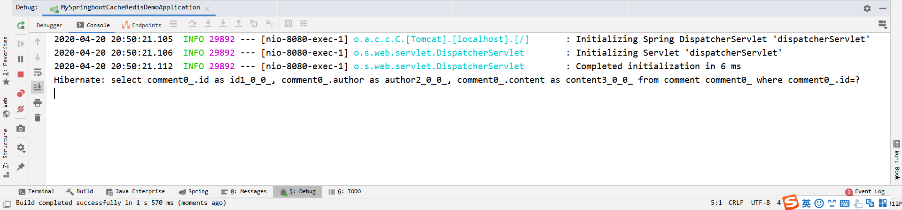
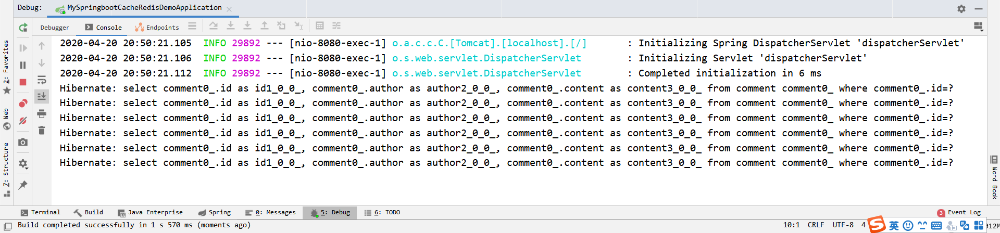
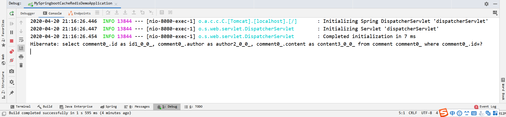

## 前言

​	Spring框架支持透明地向应用程序添加缓存对缓存进行管理,其管理缓存的核心是将缓存应用于操作数据的方法，从而减少操作数据的执行次数，同时不会对程序本身造成任何干扰。

​	Spring Boot继承了 Spring框架的缓存管理功能，通过使用`@EnableCaching`注解开启基于注解的缓存支  持, Spring Boot就可以启动缓存管理的自动化配置。

## 1. 不使用缓存

### 1. 环境搭建

#### 1. 数据库

创建名为springbootdata的数据库，运行提供的sql脚本即可生成数据表comment和一些测试数据。


#### 2. 创建项目及编写配置信息

使用Spring Initializr创建一个项目，需要勾选的依赖有JPA、Mybatis和Web，而后在application.properties中配置数据库连接信息并开启sql打印到控制台，以便我们观察：

```properties
# MySQL数据库连接配置
spring.datasource.url=jdbc:mysql://localhost:3306/springbootdata?serverTimezone=UTC
spring.datasource.username=root
spring.datasource.password=123456

#显示使用JPA进行数据库查询的SQL语句
spring.jpa.show-sql=true
```


#### 3. 编写实体

针对`comment`表编写`Comment`类与其互为映射关系

```java
@Entity	//@Entity标注这个类是个实体类
@Table(name = "comment")	//@Table(name="comment")标注将该实体类与数据库中名为comment的表进行映射
public class Comment {
    @Id	//@Id标注id属性映射数据表comment的主键
    @GeneratedValue(strategy = GenerationType.IDENTITY)	//因为comment表主键设置了自增，在映射的实体类中标注为主键的属性还需要指定生成策略strategy为自增GenerationType.IDENTITY
    private Integer id;
    
    //@Column(name="context")	//如果数据表字段与实体属性名不一致，可以通过@Column对其进行映射
    private String content;
    
    private String author;
    
    //省略toString和get set方法
}
```


#### 4. 编写功能代码

我比较习惯先从持久层开始写起，先写如何与数据库进行交互，慢慢往调用层写，于是先写个`CommentRepository`类继承`JpaRepository`就完事儿了：

```java
/**
 *继承 JpaRepository 接口可以无需编写sql来实现简单的数据库操作
 */
public interface CommentRepository extends JpaRepository<Comment, Integer> {}
```

Service层创建`AnnoCommentService`类来个`findCommentById`方法，见名思义通过id查询comment：

```JAVA
@Service
public class AnnoCommentService {
    @Autowired
    private CommentRepository commentRepository;

    public Comment findCommentById(Integer id) {
        Optional<Comment> optional = commentRepository.findById(id);
        if (optional.isPresent()) {
            Comment comment = optional.get();
            return comment;
        }
        return null;
    }
}
```

Controller层创建个`CommentController`类来个同名方法，拦截`/anno/findCommentById`请求，获取一个Integer参数，调用`CommentService`对象的`findCommentById`方法来获得相应的comment显示到浏览器上：

```JAVA
@RestController
public class AnnoCommentController {

    @Autowired
    private AnnoCommentService annoCommentService;

    @RequestMapping("/findCommentById")
    public Comment findCommentById(Integer id) {
        Comment comment = annoCommentService.findCommentById(id);
        return comment;

    }
}
```


#### 5. 运行系统分析问题

运行项目，首次发出请求http://localhost:8080/anno/findCommentById?id=1可以看到控制台输出查询SQL



接着发几次相同的请求，控制台就输出几条执行的SQL



这说明了每次我们发出请求，后台都要和数据库进行交互获取数据，量变会引起质变，大量的请求会让我们的系统变得很“慢”，原因就在于与数据库的频繁IO。


## 2. 使用Spring默认缓存

Spring框架为我们提供了缓存支持，在项目启动类标注`@EnableCaching`表示开启缓存支持

```JAVA
@EnableCaching	//开启缓存注解
@SpringBootApplication
public class MySpringbootCacheRedisDemoApplication {

    public static void main(String[] args) {
        SpringApplication.run(MySpringbootCacheRedisDemoApplication.class, args);
    }

}
```

然后在需要做缓存的方法上添加`@Cacheable`注解

```JAVA
@Cacheable(cacheNames = "comment")
public Comment findCommentById(Integer id) {
    Optional<Comment> optional = commentRepository.findById(id);
    if (optional.isPresent()) {
        Comment comment = optional.get();
        return comment;
    }
    return null;
}
```

`cacheNames = "comment"`表示会将要缓存的数据存到名为comment的命名空间中，这个后续详述。

验证一下加了缓存后效果O不OK。发出多次相同的请求，控制台输出：



可以发现无论发出几次相同的请求，都只会向数据库请求一次数据，这就是缓存的作用。

## 后续

效果实现了，那么该来扒一扒底层原理了——