## 前言

​	在系统中使用了缓存达到相同的请求只向数据库发出一次请求的效果，那缓存在底层是怎么实现的呢？


## 1. 找官网

​		还是按自己的习惯，有技术上的问题，先上对应的官网看看有没有相关的信息，这里记录一下自己的操作。

​	我是在SpringBoot项目上使用缓存，所以到[SpringBoot官网](https://spring.io/projects/spring-boot)，当前我使用的是`2.2.6.RELEASE`版本

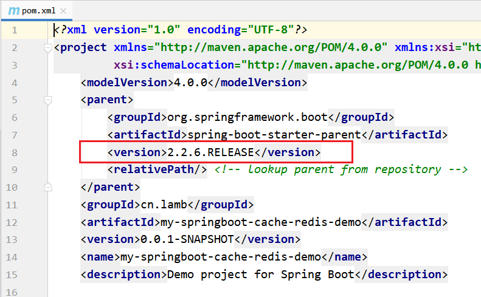

查看[对应版本文档](https://docs.spring.io/spring-boot/docs/2.2.6.RELEASE/reference/html/)

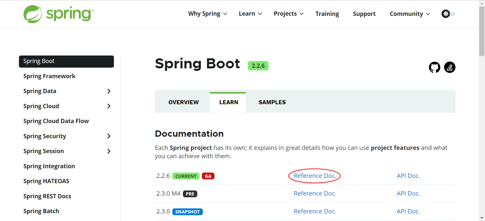

缓存是其当中一种功能，所以看到[Spring Boot Features](https://docs.spring.io/spring-boot/docs/2.2.6.RELEASE/reference/html/spring-boot-features.html#boot-features)

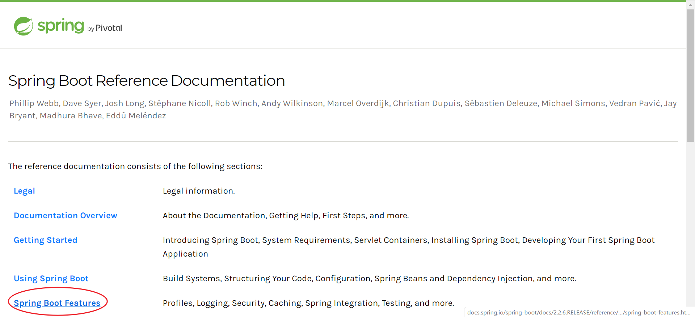

全文搜索Caching即可锁定我们的要关注的缓存功能

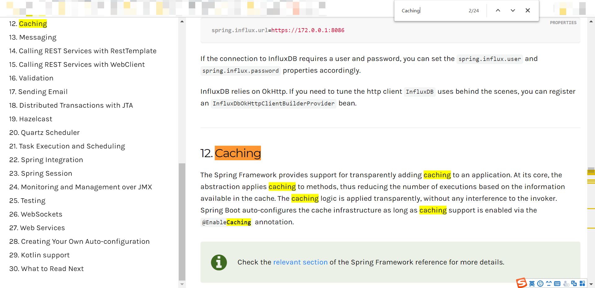

看看它是怎么介绍的：

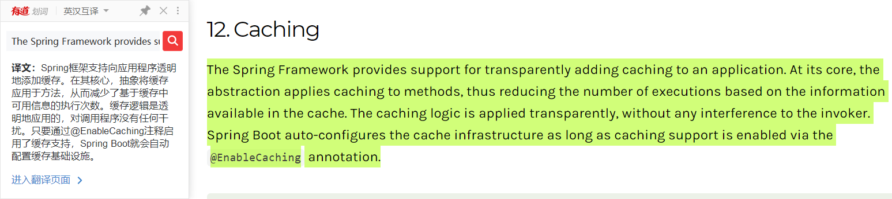

​	官网告诉我们在想使用缓存时要加上`@EnableCaching`注解，我们也正是这么做的，实际上，缓存并不是SpringBoot框架独有的东西，而是他爹Spring框架就有的，具体如何使用缓存注解应该去看[Spring官网有关缓存的部分](https://docs.spring.io/spring/docs/5.2.5.RELEASE/spring-framework-reference/integration.html#cache)。缓存的**使用**不是本篇的重点，所以继续往下看：

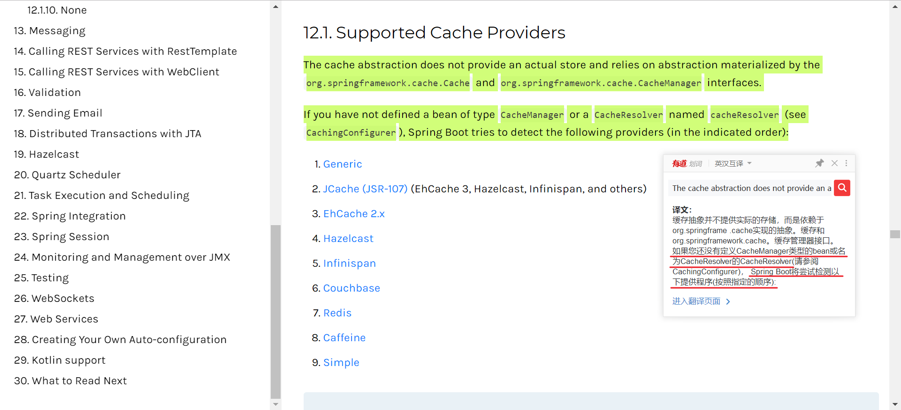

从官网这段描述我们可以得到两个信息：

1. 缓存抽象是不干活的，它需要依赖实现了`org.springframework.cache.Cache`缓存接口和`org.springframework.cache.CacheManager`缓存管理器接口的具体实现类来做缓存存储这件事。这些具体实现类就叫Cache Provider缓存提供器。
2. 开发者是可以自定义缓存管理器CacheManager的（后续详述），而如果我们没有自定义，SpringBoot就会检测我们有没有使用第三方的缓存管理器，如果有且有多个，就会以既定的顺序提供服务。

我们在上一篇并没有使用其他缓存提供器就达到缓存的效果，可想而知一定是SpringBoot有默认操作


将目标锁定到最后一个提供器[Simple](https://docs.spring.io/spring-boot/docs/2.2.6.RELEASE/reference/html/spring-boot-features.html#boot-features-caching-provider-simple)，它是这么解释的：如果我们不指定其他的提供器，就默认使用ConcurrentHashMap做缓存的存储。

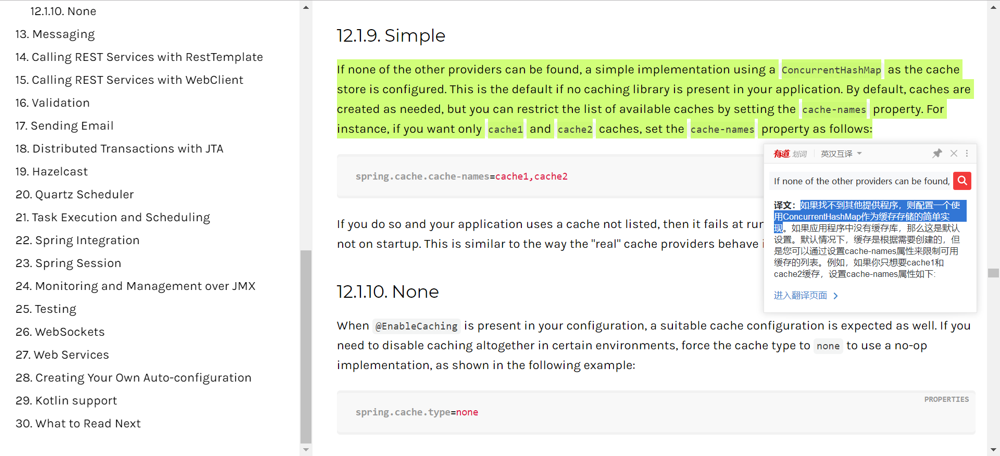

想知道底层实现，接下来就要以Simple和Cache做关键字扒源码。

## 2. 看源码

以Simple和Cache作为关键字搜索相关类，似乎一下子就找到了我们的目标

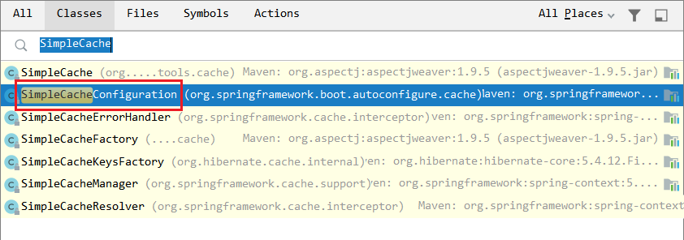

浏览`SimpleCacheConfiguration`源码

```JAVA
/**
 * Simplest cache configuration, usually used as a fallback.
 *
 * @author Stephane Nicoll
 */
@Configuration(proxyBeanMethods = false)	//该类是个配置类，在SpringBoot启动
@ConditionalOnMissingBean(CacheManager.class)	//
@Conditional(CacheCondition.class)
class SimpleCacheConfiguration {
    //暂时不看逻辑代码
}
```

首先关注它的两个重点注解：

`@Configuration(proxyBeanMethods = false)`表示`SimpleCacheConfiguration`是个配置类
`@ConditionalOnMissingBean(CacheManager.class)`表示在Spring容器中没有`CacheManager`组件才允许SpringBoot自动配置该类。

再来看看这个配置类具体做了什么

```JAVA
class SimpleCacheConfiguration {
	@Bean
	ConcurrentMapCacheManager cacheManager(CacheProperties cacheProperties,
			CacheManagerCustomizers cacheManagerCustomizers) {
        //1.创建一个ConcurrentMapCacheManager对象
		ConcurrentMapCacheManager cacheManager = new ConcurrentMapCacheManager();
		List<String> cacheNames = cacheProperties.getCacheNames();
		if (!cacheNames.isEmpty()) {
			cacheManager.setCacheNames(cacheNames);
		}
		return cacheManagerCustomizers.customize(cacheManager);
	}
}
```

首先创建了一个缓存管理器`ConcurrentMapCacheManager`对象，`ConcurrentMapCacheManager`部分源码：

```JAVA
public class ConcurrentMapCacheManager implements CacheManager, BeanClassLoaderAware {

	private final ConcurrentMap<String, Cache> cacheMap = new ConcurrentHashMap<>(16);
    //以下忽略
}
```

可见`ConcurrentMapCacheManager`维护一个`ConcurrentMap`对象，这个`ConcurrentMap`对象就是SpringBoot用来存储缓存数据的容器，key为String，value为Cache，至于key和value长什么样，后续详述。


## 3. 缓存实践

我已经大致摸到了SpringBoot缓存的底层代码，得知所谓的“缓存”就是在`ConcurrentMapCacheManager`类中维护一个Map容器来存储数据这么个操作，为了研究这个Map容器的作用，我可以先看看`ConcurrentMapCacheManager`类源码。

#### ConcurrentMapCacheManager源码结构

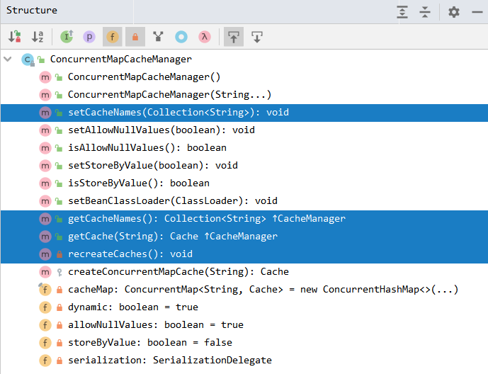

通过查询我锁定了使用到`ConcurrentMap`对象`cacheMap`的地方在4个方法：`setCacheNames`、`getCacheNames`、`getCache`、`recreateCaches`，接下来的调试也会重点看这几个方法。


#### 首次发请求看流程

当我第一次发出请求后http://localhost:8080/anno/findCommentById?id=1，代码会经过Controller执行到Service层：

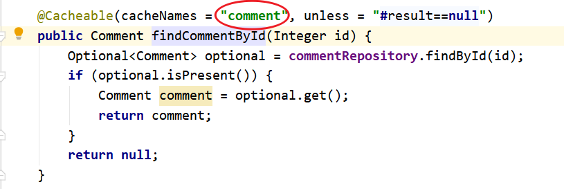

执行到`commentRepository.findById(id);`会先携带`@Cacheable`注解属性`cacheNames`的值`comment`去到`ConcurrentMapCacheManager`的`getCache`方法中：

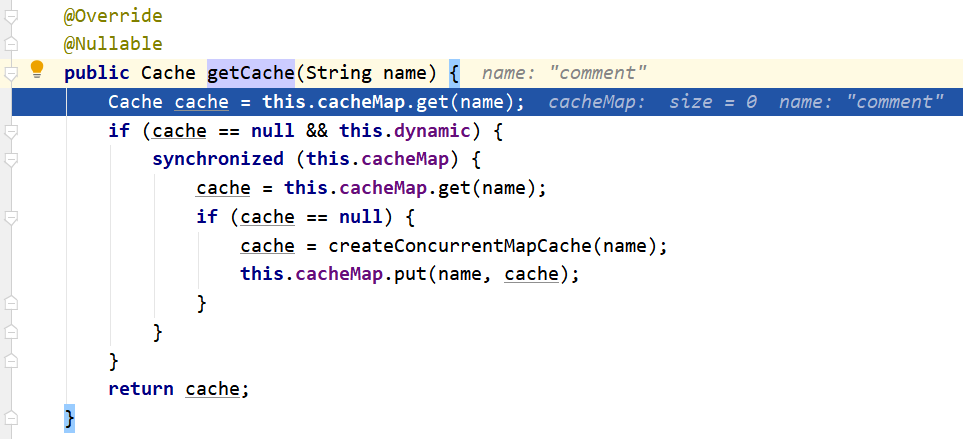

由于是首次请求数据，在缓存中获取不到数据，即`cacheMap.get(name)`为`null`，于是进到`createConcurrentMapCache`方法，创建一个`ConcurrentMapCache`对象，这个对象就是用来存储所有命名空间为参数`name`（此处为comment）的缓存数据的Map容器：

```java
protected Cache createConcurrentMapCache(String name) {
    SerializationDelegate actualSerialization = (isStoreByValue() ? this.serialization : null);
    return new ConcurrentMapCache(name, new ConcurrentHashMap<>(256),isAllowNullValues(), actualSerialization);

}
```

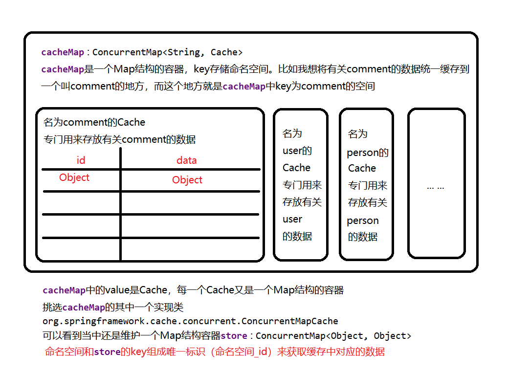

接着`this.cacheMap.put(name, cache);`将命名空间为comment的缓存容器放入大缓存容器`cacheMap`中。继续执行代码到`CacheAspectSupport`的`execute`方法，当中有个关键判断——当无缓存数据时，反射调用方法去查询数据库获取数据：

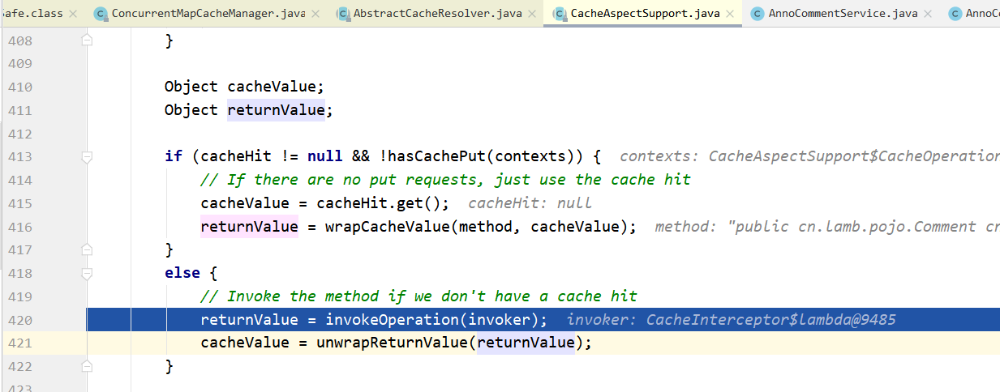

首次到数据库会打印SQL：

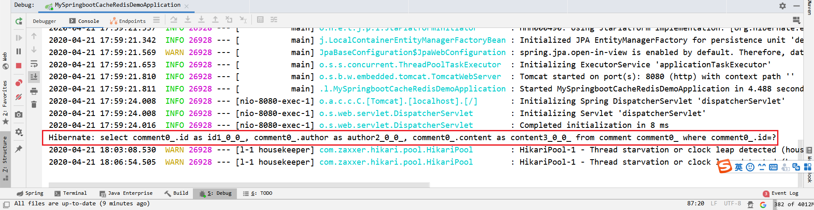

查询后，会将查询获得的数据（如果有）保存到缓存中：

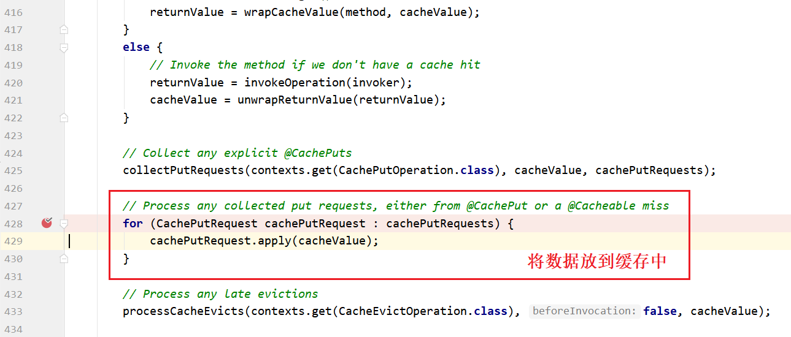

`apply`方法和真正将数据保存到`cacheMap`的`doPut`方法：

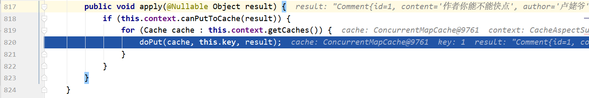

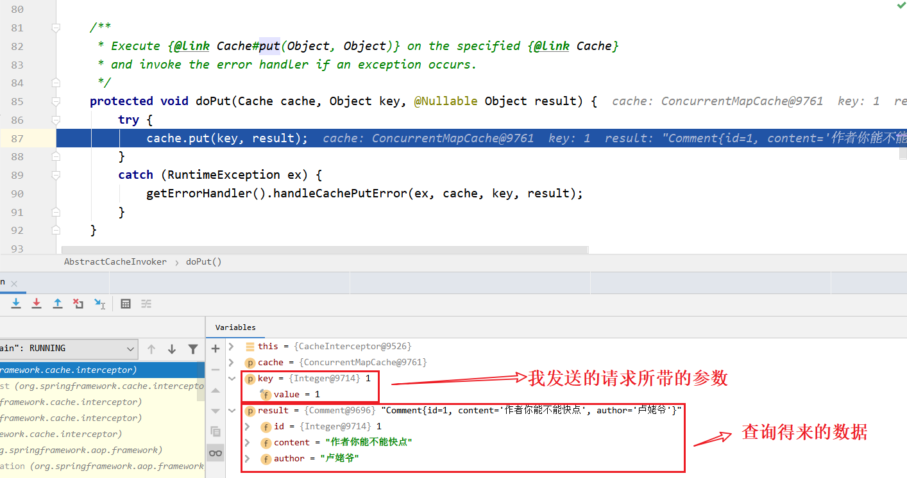

至此，数据已经被成功查询且缓存起来了。


#### 二次发请求看流程

接下来我需要验证一下，是否首次查询之后，再发起相同的请求会使用缓存数据而不是到数据库中查询，于是我再次发起相同的请求http://localhost:8080/anno/findCommentById?id=1

与首次发起请求不同的是，在`ConcurrentMapCacheManager`的`getCache`方法中，`this.cacheMap.get(name)`可以获取到缓存的数据。

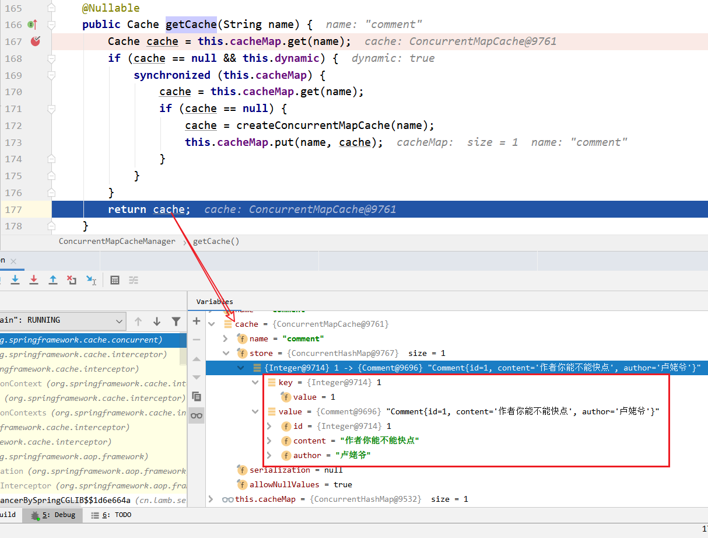可以直接返回缓存数据，同样在`CacheAspectSupport`的`execute`方法中也不需要走“无缓存分支”，直接使用首次请求时查询的数据即可。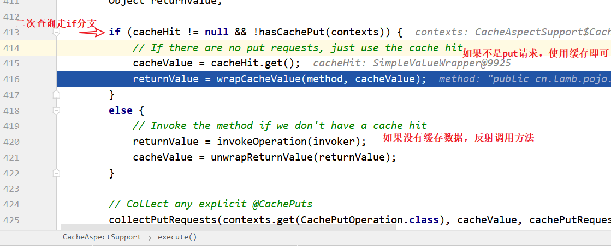

至此，我们知道数据访问时引入缓存机制带来的好处了。


## 后续

​	实现了缓存的效果，其实我们还有很多问题（如缓存中的key-value长什么样）没有探索，这是其一；其二，纵然Spring提供了缓存的功能，但术业有专攻，Spring家族主攻对象的创建管理，SpringBoot主攻依赖管理和配置自动化，缓存是他们不擅长也不需要擅长的领域，缓存的事自然有缓存中间件来做，下一篇就来通过引入Redis缓存中间件来讨论。